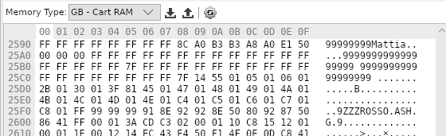
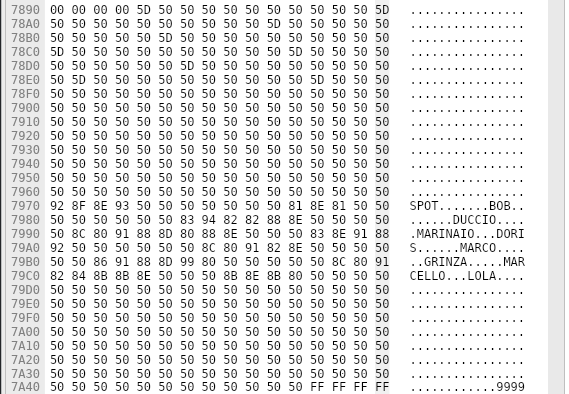
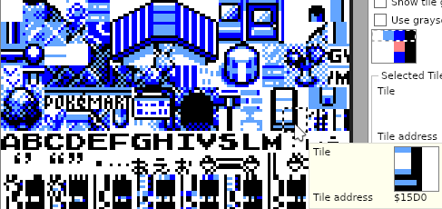
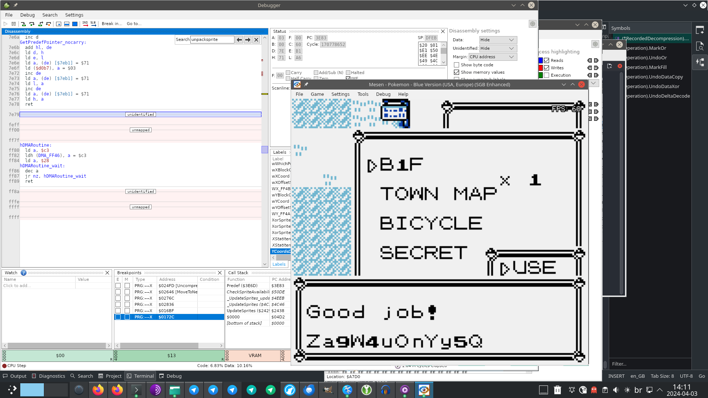

# Hacking Challenge I - Hall of Fame Data Recovery (Red/Blue)

[Go back to main page](/README.md)

> B1F is a truly amazing item. I used it to keep a small ACE payload which reminded me of my super secret password. But I encountered Missingno. in battle, and my payload got destroyed!
Think it's still possible to recover it? [Here's the save file I got after the incident](https://fools2024.online/assets/rest_in_miss_forever_ingno.sav).

In this challenge, we had to recover a payload that had been corrupted by [Missingno.](https://glitchcity.wiki/wiki/MissingNo.)'s sprite decompression. This payload consisted of a short snippet of code at a specific address (0xA7D0) that, when executed by a glitch item called B1F (which was already in the inventory in the save file), triggered a message box to display on the screen containing the flag for this challenge.

## My approach, in a nutshell

In short, I wrote a very special Gen 1 sprite decompressor - a journalling one. It works by first running the decompression, but not writing any data to the destination memory region - it instead writes a journal of the operations performed. This journal is then read in reverse, from the end to the beginning, and the operations are undone on the corrupted memory region, bringing it back to the uncorrupted state - or at least, uncorrupted enough that the data of interest is readable, as we'll see below.

## Initial analysis

_**NOTE:** This part was added in 2024-04-18, one day after this write-up's initial release._

_Updated in 2024-04-24 - fixed some factual mistakes._

Upon loading the save file, the first thing we can notice is the player's name, `Mattiaᴾₖ`. Further analysis of the save file shows us that the rival name is `ROSSO`, and that there are some suspiciously Italian-sounding Pokémon nicknames in Box 12 of the save file:

<p align=center>
  
</p>

<p align=center>
  
</p>

This led to a theory around the GCRI Discord that the challenge was to be done on the Italian version of the game - after all, MattiaPk could be a reference to Mattia Cognetta, the winner of the 2023 Pokémon Europe International Championship's Video Game Senior Division. This was quickly disproven by simply trying to load the save on the Italian version of the game and trying to encounter Missingno. - the game crashes on a black screen before the battle even loads.

By tracing through the decompression process, the reason becomes apparent - Italian Missingno's dimensions in the Pokémon data structure, unlike in its compressed sprite data, is 0x0. This causes the game to try to overwrite almost the entire game's SRAM and RAM with garbage. It is stopped short, however, by the VBlank interrupt, after the sound bank address (`0xC0EF`) is overwritten with the value `0xEA` taken from ROM, mapping to bank `0x3A` which is fully padded with `0x00` bytes. When the game tries to execute sound code from this bank, it falls into a NOP sled straight into VRAM, ultimately executing an rst 38 instruction due to VRAM inaccessibility and crashing.

There's also something really fishy about the Pokémon nicknames in the save file. Right above the Pokémon nicknames in the screenshot you can see the section of memory that holds the OT names for the Pokémon. Notice how all of their OTs only have a single character - `0x5D` - and you can barely spot it. Well, what's character `0x5D` in the Pokémon character set, you might ask? I'll tell you right away - it's not part of the character set, but of the current map's tileset. (note: the garbage at the bottom is not part of the tileset, but the tilemap represented as if it were graphic characters)

<p align=center>
  
</p>

So, these Pokémon were very likely hacked in somehow! This is a very clever red herring.

What does this all mean, after all? There's no way that this challenge could have been done on the Italian version of the game. So back to the English version it was.

## A primer on Gen 1 sprite decompression

Pokémon Gen 1 is unique amongst retro games for its intricate sprite decompression algorithm, which has characteristics that set it apart from other compression algorithms from other games of the era, such as working down at the bit level, using bit-pair encoding, delta encoding, and most notably the use of Exp-Golomb encoding (which is still in use in modern video codecs). I shall go over some of the aspects of Pokémon Gen 1 sprite decompression and explain how we'll need to deal with them when trying to recover the data.

Gen 1 sprite decompression has multiple modes (there's 3 modes with 2 variants for each!), but all of them can be abstracted into three main steps:

1. Data imprinting
2. Post-processing
3. Copying/aligning sprite data

We'll go over them one by one.

### Data imprinting

The data imprinting process consists of decompressing the actual compressed pixel data into the buffers. To understand how this works, we must delve a bit into how the actual data compression works.

#### The compression algorithm

The data is encoded as a stream of bit pairs which is compressed using a special version of order-1 Exp-Golomb-coded zero-RLE. That may sound like a mouthful to many of you, so let's break it down.

Zero-RLE works in the following way - the decompressor switches back and forth between:

- the literal mode, where it copies non-zero symbols (in this case, the bit-pairs `01`, `10` and `11`) from the input to the output until it finds a zero symbol (in this case, the bit pair `00`, which is skipped and not copied)
- the RLE mode, where it reads a number representing the amount of zero symbols to be written to the output (in this case, encoded using a special version of order-1 Exp-Golomb coding).

Higher compression is achieved by preprocessing the data to have lots of runs of zero symbols, and then post-processing it after decompression to reverse the preprocessing step.

#### What **actually** happens during the decompression

The decompression buffers are wiped before the decompression begins, and when copying bit-pairs to the output, the game imprints bits onto the buffer using an OR operation.

The buffers are fixed-size, however (7x7 tiles, or 0x188 bytes). If a buffer overflow happens due to a sprite that's larger than the buffers (such as Missingno.'s sprite which is 13x13 tiles), regions of memory containing non-zero bits will be OR'd together with the pixel data, resulting in possible data loss. Therefore, the data imprinting operation is partially irreversible.

_As a curiosity, if the game used an XOR operation rather than an OR operation, the result would have been the same for valid sprites since the contents of the buffer would have been wiped at the beginning and 0 XOR 1 = 1, but the data imprinting on the overflow region would have been reversible._

Luckily, however, not all regions of memory are affected by the data imprinting process. Due to the nature of RLE compression, Exp-Golomb coding and glitch sprite data, there's bound to be some degree of sparsity in the coverage of regions affected by the data imprinting process in Missingno.'s sprite. We can visualize this by computing a bitmap of memory that's affected by the data imprinting process. This is what part of that looks like:

```
(...)
0000a600: 0000 0000 0400 0000 0000 0000 00c0 40c0 c040 0000 c080 0000 0000 0040 44c8 cc4c  ..............@..@.........@D..L
0000a620: c404 040c 0000 0000 0000 0000 0000 0000 0004 0800 0c08 00c0 03c3 c282 8203 4380  ..............................C.
0000a640: 4004 0000 0000 0000 0000 0000 0000 0000 0000 0021 3320 2020 3030 0000 0000 0000  @..................!3   00......
0000a660: 0102 0001 0203 0300 0000 0000 0000 0000 0000 4080 2060 80c0 0000 0050 c080 0000  ..................@. `.....P....
0000a680: c000 001c 1800 000c 0000 000c 0c08 44cc 0ccc c084 8800 4080 4000 0800 4080 c080  ..............D.......@.@...@...
0000a6a0: 0400 0000 0000 0000 0040 0000 8080 4000 0000 0000 0000 0000 0000 8000 0200 0101  .........@....@.................
0000a6c0: 0300 0000 0000 0000 0000 0000 0000 0203 0000 0000 0000 0000 0000 0000 0000 0000  ................................
0000a6e0: 0000 0000 0000 0000 0000 0000 0000 0000 0000 0000 0000 0000 0000 0000 0000 0000  ................................
0000a700: 0000 0000 0000 0000 0000 0000 0000 0000 0000 0000 0000 0000 0000 0000 0000 0000  ................................
0000a720: 0000 0000 0000 0000 0000 0000 0000 0000 0000 0000 0000 0000 0000 0000 0000 0000  ................................
0000a740: 0000 0000 0000 0000 0000 0000 0000 0000 0000 0000 0000 0000 0000 0000 0000 0000  ................................
0000a760: 0000 0000 0000 0000 0000 0000 0000 0000 0000 0000 0000 0000 0000 0000 0000 0000  ................................
0000a780: 0000 0000 0000 0000 0000 0000 0000 0000 0000 0000 0000 0000 0000 0000 0000 0000  ................................
0000a7a0: 0000 0000 0000 0000 0000 0000 0000 0000 0000 0000 0000 0000 0000 0000 0000 0000  ................................
0000a7c0: 0000 0000 0000 0000 0000 0000 0000 0000 0000 0000 0000 0000 0000 0000 0000 0000  ................................
0000a7e0: 0000 0000 0000 0000 0000 0000 0000 0000 0000 0000 0000 0000 0000 0000 0000 0000  ................................
0000a800: 0000 0102 0000 0000 0300 0302 0000 0202 0202 0200 0000 0000 0000 0000 0000 0000  ................................
0000a820: 0103 0300 0000 0000 0000 0000 0000 0000 0000 0000 0000 0000 0000 0000 0000 0000  ................................
0000a840: 0000 0000 0000 0000 0000 0000 0000 0000 0000 0000 0000 0000 0000 0000 0000 0000  ................................
```

As you can see, there is a huge gap spanning from 0xA6D0 to 0xA801, which just happens to be within the range of 0xA7D0. This means that our payload is safe from the data imprinting process.

I still tried to undo this operation by writing zero bits at the affected locations, even though it wasn't necessary.

### Post-processing

The post-processing step consists of a few of sub-steps which depend on the selected encoding mode. Nevertheless, they are all reversible. For Missingno., those are:

1. Perform delta decode on bitplane 2
2. Perform delta decode on bitplane 1
3. XOR bitplane 1 with bitplane 2, and store the result in bitplane 2

XOR decoding consists in literally performing the exclusive OR of bitplanes 1 and 2, and storing it in bitplane 2. Reversing the XOR operation primitive is straightforward, as it simply means executing it again. There's not too much else to explain.

Delta decoding, or more specifically, binary delta decoding, is a method used to encode areas of flat color in the image in order to maximize the number of zero bits - which as explained before, improves the compression ratio for zero-RLE. It works by essentially integrating the bitstream:

```
Original bitstream:      000100011100010010001000010
Delta-decoded bitstream: 000111101000011100001111100
```

For reversing the delta decode primitive, however, I had to implement a "lookahead" (actually behind) differentiator which required me to not only reference the current byte, but the previous byte for the edge case.

### Copying/aligning sprite data

_Updated in 2024-04-24 - fixed some factual mistakes._

In this last step, the game copies bitplanes 1 and 2 to bitplanes 0 and 1, while aligning them to a 7x7 bounding box, which is what the game always uses for displaying sprites. The decompression is always performed at the sprite's native size, while this last step is used to position the sprite's byte columns in place on the 7x7 bounding box.

This of course goes horribly wrong when the sprite's dimensions are bigger than 7x7 (or smaller than 1x1). The buffer overflows and the algorithm ends up overwriting data out of bounds.

One interesting thing to point out about this step is that it is technically not part of the compression algorithm, but of the sprite loading routine. As such, it doesn't use the sprite size byte from the sprite's bitstream, but a different sprite size byte taken from elsewhere. For glitch sprites, these can be (and usually are) different; for Missingno, this second size byte is 8x8 tiles - smaller than the initial sprite size.

Another lucky factor for us is that the copy start position is reset and advanced by a fixed amount for every column, due to how the routine is designed to align sprites. Specifically, the column start position only advances by 56 bytes for every copied column, no matter the size of each copied column. This means that the data for the next copied column may overwrite part of the data from the last column, but that doesn't matter for us, as all we care about is that the data at `0xA7D0` is preserved.

A quick calculation shows us that the max offset achieved by the copy/align routine when aligning Missingno.'s sprite is `56*7 + 8*8 = 456 bytes`, and the starting position for Missingno.'s sprite is 248 bytes in, so using bitplane 1 to maximize the achievable memory address we get `0xA448`. Pretty safe from `0xA7D0`.

I still ended up trying to undo this operation anyway. I don't think it would have been very effective if it actually mattered. It's pretty lossy.

## Difficulties

My main difficulty with this challenge was not in understanding the challenge or understanding Pokémon decompression, but in dealing with bugs in my code. I thought my approach was pretty sane from the very beginning. But if there's one thing I dislike about Go, it's how easy it is to accidentally redeclare a variable inside a scope using `:=`. The highlighter in Kate does not give me any hint about this, unlike some proprietary IDEs I've used before.

I added the ability to decompress Pokémon sprites to my code. I ended up doing this because I added end-to-end tests to it in order to test the delta and XOR undecoding in order to see if they were fine, so I implemented a delta decoder and a XOR decoder. When I tested the system using a fuzzer, it turned out that the delta decoder I implemented for testing was broken and that the original delta undecoder was just fine. Anyway, using Pokémon decompression to test my code was primordial in tracking down the remaining bugs in it by comparing the results to the game's code flow and SRAM data.

## Executing the program

Once I had the program working, it was a matter of executing it and reviewing the results (NOTE: log dates are not representative of when I completed the challenge):

```
$ go run main.go rest_in_miss_forever_ingno.sav 
2024/04/17 10:52:37 Clearing buffers
2024/04/17 10:52:37 - clearing BP1...
2024/04/17 10:52:37 - clearing BP2...
2024/04/17 10:52:37 Sprite size is 13x13
2024/04/17 10:52:37 Starting with BP1, then BP2
2024/04/17 10:52:37 Decompressing plane 0 into BP1...
2024/04/17 10:52:37 Decompressing plane 1 into BP2...
2024/04/17 10:52:37 Using decode mode 3
2024/04/17 10:52:37 Performing delta decode on BP2
2024/04/17 10:52:37 Performing delta decode on BP1
2024/04/17 10:52:37 Applying XOR from BP1 to BP2
2024/04/17 10:52:37 Copying/aligning sprite data with size 8x8...
2024/04/17 10:52:37 - clearing BP0...
2024/04/17 10:52:37 - clearing BP1...
2024/04/17 10:52:37 Interlacing buffers...
2024/04/17 10:52:37 Undoing recorded decompression journal over saved data...
2024/04/17 10:52:37 Done.
```

```
$ xxd result.bin | less
(...)
0000a7c0: ffff ffff ffff ffff ffff ffff ffff ffff  ................
0000a7d0: 21d6 a7c3 493c 0086 aeae a37f a9ae a1e7  !...I<..........
0000a7e0: 4f99 a0ff 96fa b48e ad98 b8fb 9058 57ff  O............XW.
0000a7f0: ffff ffff ffff ffff ffff ffff ffff ffff  ................
```
And there, at 0xA7D0, was my payload! After pasting this into the emulator's memory editor at the correct location, opening the item menu in the game and using B1F, I got my flag! Here is the genuine screenshot from the moment (complete with my desktop mess for y'all to see):

<p align=center>
  
</p>

## Epilogue

This was the first challenge I did, and my favorite challenge out of all of them. It was the perfect balance of challenging enough, not very hard while still interesting, and it was about a topic I really like which is graphics compression.

This was also my first time implementing the Gen 1 sprite decompression for myself, surprisingly enough, given how much I adore it. I like to tell this over and over, but when IsoFrieze teased out his video on the Gen 1 sprite decompression algorithm, I couldn't wait for him to release it and I went to study the algorithm for myself by reading the game's disassembly, and that's how I learned how it worked.

Looking back at it, if it weren't for the stupid bugs I encountered while making my undecompressor, it could have only taken me the better part of a day to do this challenge. It took three days instead. But of course, what matters the most is that it was fun. No regrets about it!

[Go back to main page](/README.md)
