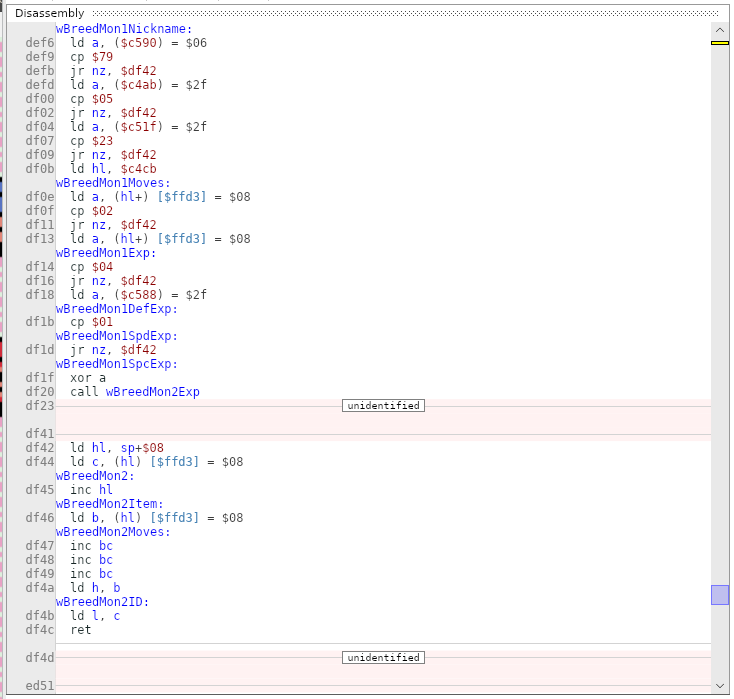
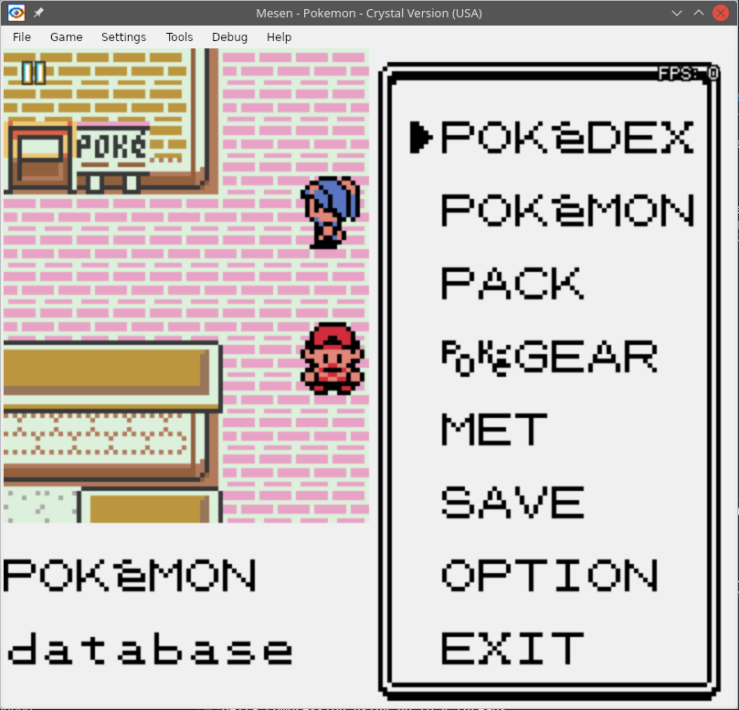
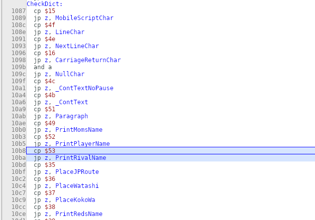
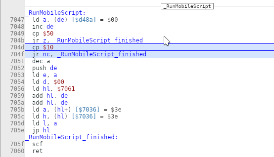
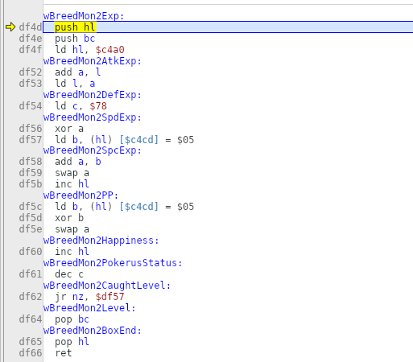
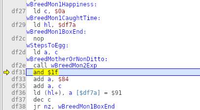
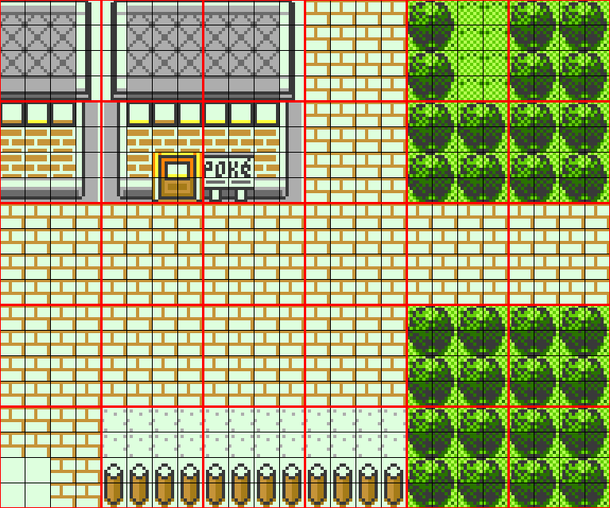
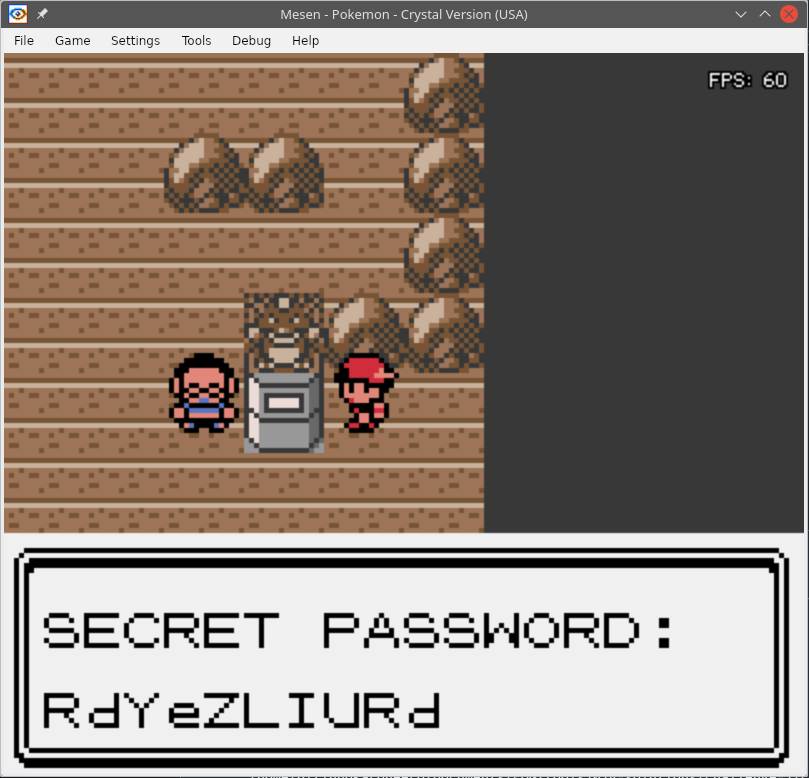
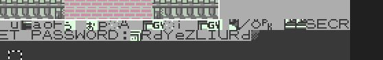

# Hacking Challenge II - The Sus-file (Crystal)

[Go back to main page](/README.md)

> I got this Pokémon Crystal save file from a friend, but it's really strange. Sometimes weird colored artifacts appear on the screen, and sometimes the game just straight up crashes. I'm sure there's something hidden in it. Maybe you'll be able to figure it out? [Here's the save file I got](https://fools2024.online/assets/suspicious.sav).

In this challenge, we were given a save file that supposedly exhibited weird behavior and we were told to find the flag in it. No further information given.

## Initial analysis

My first instinct was to attach debug symbols to the ROM, fire up the emulator's debugger and attempt to break execution at various points to see if I could find arbitrary code being executed. I initially suspected that [OAM DMA hijacking](https://glitchcity.wiki/wiki/OAM_DMA_hijacking) could be the mechanism used here (I was wrong). After a minute of tinkering, I couldn't find anything, but upon breaking execution and looking around the address space I quickly found what looked like part of the payload laying around in work RAM:

<p align=center>
  
</p>

By tracing around, I quickly figured out that displaying the player's name was the trigger for executing this code. To understand how the player's name can make the game execute code, we need to take a look at the game's text command processor for a bit.

### Pokémon Gen 2's text command processor

When you try to display a text box in Pokémon, the game uses a command interpreter where non-text bytes are assigned to commands that perform actions such as:

- Printing common dictionary words
- Printing dynamic strings from memory (e.g. player name, rival name)
- Dynamically generating strings (e.g. amount of money, time of the day, day of the week)
- Flow control (pausing and displaying an arrow in the corner, waiting for the player to press A or B to continue)
- Scrolling the text box, moving to the next line, clearing the text box etc.
- Displaying a subwindow that allows the player to choose yes/no

In this save file, the player's name is constructed in a very intricate way. Here's the hex dump of the player's name, and let's break it down:

```
8C 84 93 53 53 53 53 53 53 38 38 38 15 00
```

The bytes `0x8C 0x84 0x93` correspond to the text string `MET`. Indeed, that's what you can see if you open the start menu, for instance. But that's all you can see. What gives?

<p align=center>
  
</p>

Let's take a look at the rest. Following the `MET` string are six `0x53` bytes. Looking at the game's disassembly, these invoke a command to print the rival's name:

<p align=center>
  
</p>

So what is the rival's name like? Well, here's the hex dump:

```
4E 4E 4E 4E 4E 4E 4E 4E 50
```

If we look at the same disassembly screenshot above, the `0x4E` bytes are "NextLineChar" commands, and there are 8 of them. Each "NextLineChar" command puts the cursor back to the start of the current line, then moves it forward by two screen rows of tiles (40 bytes). In the end there's a `0x50` byte which is a string terminator, allowing the game to go back to processing the player name.

Since there are 8 "NextLineChar" commands per rival name invocation, and there are 6 rival name invocations, and each "NextLineChar" command puts the cursor forward by 40 bytes, this results in the cursor moving forward by 1920 bytes, way past the screen buffer!

After that, going back to the player's name, we have three `0x38` bytes. These are "PrintRedsName" commands. For whatever reason, Red's name is in RAM? I don't remember Pokémon Gen 2 allowing you to give a name to Red. Anyway, let's take a look at Red's name in hex:

```
D0 D0 22 D0 D0 22 D0 D0 22 50
```

We have three instances of the bytes `0xD0 0xD0 0x22`. This prints the bytes `0xD0 0xD0` literally (which are the tile character 'd) and then skips to the next tile line with a "LineFeedChar" command, therefore advancing 20 bytes from the start of the line (skipping 18 bytes from the end).

The byte `0xD0` encodes the instruction `ret nc` in SM83 assembly. This will be important for later.

The last two characters, `0x15 0x00` in the player's name, actually form a multi-byte command. Byte `0x15` maps to the command "MobileScriptChar". This was used for a bonkers feature in Gen 2 that was exclusive for the Japanese version of the game, which allowed you to hook up a mobile phone to the Game Boy using an adapter and connect to other players via a GSM/GPRS connection. Even though the feature didn't work in the International versions of the game, there was still plenty of vestigial code for it left.

Interestingly enough, they could have almost avoided this arbitrary code execution exploit. They did think to put range checking into this function, as you can see below - it does check that the script command ID does not exceed the number of valid command IDs:

<p align=center>
  
</p>

Unfortunately, they forgot to account for command ID `0x00` - which is exactly what is exploited here. The game decrements the command ID, making it underflow to 255, and the mobile script jump table is indexed out of bounds. For the luck and prowess of many glitch scientists around the world, the resulting pointer lands right in `0xCD52`, in the middle of work RAM.

One of the targeted locations by Red's name's memory corruption is `0xCD5B-0xCD5C`. The memory contents of the region between `0xCD52` and `0xCD5A` seem to be usually comprised of `0x00` bytes, which encode `nop` instructions; this means that in most cases, the game will happily slide along to `0xCD5B` and fall into the `ret nc` instruction that was written beforehand. Since the carry flag is cleared when coming from the RunMobileScript subroutine, execution will return. But not to the RunMobileScript subroutine. Where to?

Look at the screenshot above - at `0x7052`, we have a `push de` instruction. What does `de` point to at the beginning of the subroutine? Well, of course, to the player's nickname! Right after it there lies packed a tight snippet of code, right before the rival name, that initializes the registers and jumps to the main payload. The payload is also responsible for properly terminating the mobile script and fooling the command interpreter into thinking that the player's name is terminated, by the way, since both the mobile script and the player name lack a terminator.

## Ok, so what?

I then proceeded to attempt to tamper with the payload.

The beginning of the payload appeared to be checking some preconditions for executing the rest of the payload. Looking at the memory addresses in question, I found out they all landed within the screen buffer. So the game seemed to be checking for the presence of certain tiles on the screen.

At first I decided I didn't have time to figure out which tiles the game wanted to see on screen, so my first attempt was to set a breakpoint at the start of the payload, open the start menu and mess with the register values and processor flags to make the game go through the happy path. This led me to this subroutine:

<p align=center>
  
</p>

It seemed to be performing a weird sort of checksum over the screen buffer. Upon returning from it, it checked for a certain result. "Whatever" - I thought - I just overrode the corresponding result register's value, which kept the payload in the happy path towards the flag. Or so I thought. This is where I landed:

<p align=center>
  
</p>

This loop, at wBreedMotherOrNonDitto, uses the same checksumming function to compute the flag using the screen buffer as a source! I was pretty bummed when I found this out. This meant, or at least I thought so, that this challenge was impossible to beat without a brute force search over every single map location in the entire game!

_Now, if you actually took part in these challenges and interacted with the community in the GCRI Discord, you'll know that I was actually so, so close to cheesing this challenge at this exact moment, and I didn't even know it! I'll explain why later in order to not spoil the fun._

## Ugh!

So, stupidity got the best of me. I decided to begin visiting some random locales in the game, in hopes of randomly coming across the trigger for the flag.

The save file starts you at Goldenrod City. I went to the Radio Tower, went to the Pokécenter, went to see some nearby trainers, went to the Game Corner... went to Saffron City, went to a few places there... even went as far as going to Indigo Plateau and beating the Elite Four to see if the ending dialogue happened to be the trigger for the flag... it wasn't. _fun fact: this was technically my first time ever beating Pokémon, if that could even count as such!_

Eventually, though, I came back to my senses and decided to just leave this challenge for last. Thank goodness!

## My approach in a nutshell

So I came crawling back... but determined to beat this challenge once and for all.

My strategy to solve this challenge was to build a data scraper that loaded all of the maps straight from the game's disassembly repo (<https://github.com/pret/pokecrystal>), and then performed the precondition checks on every tile offset of the map, reporting back if there were any maps+offsets at which there was a match.

## What are Pokémon Gen 2 maps made up of?

The main components of a map in Pokémon Gen 2, for our interests, are:

- a data structure called a "map attribute header"
- an array of "map blocks"

There are other components that are part of a map, but they aren't important for us here.

The "map attribute header" defines various properties of the map, such as its size in blocks, which block ID to fill the border with, which tileset it uses, what maps it connects with, among other things.

The array of "map blocks" is a one-dimensional array of bytes that defines which blocks the map is comprised of. The blocks are placed in the map from top to bottom, left to right. The look and feel, as well as properties of each block (collision etc.), are defined by the tileset used by the map. Below is an example of a section of the map of Celadon City with a grid overlaid on top of it:

<p align=center>
  
</p>

You can see above how the map is split into 32x32 pixel map blocks, and those map blocks are further split into 8x8 pixel tiles.

## Parsing the file structure in pokecrystal

I had to construct a total of 8 parsing functions, which parse 7 different files containing lists of maps and tileset definitions as well as file names for tileset block and map block data.

Those functions use mainly regular expressions in order to parse the files. Some of them are context-sensitive. They all run as coroutines, but not all in parallel since they're highly interdependent. One of them even acts as a server of tileset attribute data. The whole thing runs as a system of microservices, essentially. I did it this way as an experiment, and I really enjoyed doing it.

Once the parsing has been done, the map attribute list is returned to the main function via the only synchronous call in the chain. The maps themselves are then loaded, one by one, and checked for the preconditions.

### Actually loading the maps

Loading the maps themselves was pretty straightforward. I did have to be careful with the border and map connections, though. The map needs to be loaded with a 3-block border around it, and then the map connections need to be loaded in a specific order: north, south, west, east.

The process of loading the map connections is also quite intricate - each map connection can be offset by a certain amount of map blocks along the connection axis. I did have a bit of trouble wrapping my head around the offset system at first, but I eventually got it right.

After the map blocks are loaded, the block data needs to be expanded into tile data, because the condition checks are performed over the screen buffer which is in tiles. We don't need to actually emulate the screen buffer for this - merely choosing the correct offsets within the tilemap buffer will do.

## Difficulties

I had two main difficulties with this challenge: morale and energy. Technically speaking, this challenge was just fine for me. I understood it perfectly. Heck, I didn't even have that many problems with bugs, unlike in challenge 1 - the bugs I did have were solved in the better part of half an hour.

But this challenge deceived me at first. I thought I had the solution, and then my expectations came crashing down. To make matters worse, I chose to spend my energy pointlessly searching for the flag in random places where I had very little chance of finding it.

After I shelved challenge 2, I went straight to challenge 3, and soon enough hit a brickwall in that. Thankfully, being able to beat challenge 4 rescued my morale, and I felt ready to go back to challenge 2 and try again, this time determined to use whatever means necessary (i.e. brute force) to beat it.

Still, I had to go at my own pace. This slowed things down considerably. I didn't think I'd even be able to do challenge 3, but I ended up not only proving myself wrong at the end, but I even had time to play some of the fangame. I'm definitely very proud of my work in this challenge.

The next time I approach a similar challenge, though, I do want to avoid spending my energy in pointless efforts.

## Running the program

Once the program was done, it was a simple matter of running it.

Upon running it, to my delight, it yielded a single result:

```
$ go run cmd/main.go 
2024/04/17 18:03:43 Found match in map PewterGym at coordinates 8, 11
```

I was so excited when I saw this. At this point, it was just a matter of going to the Pewter Gym, triangulating the coordinate in question (note: map coordinates start at 0), and talking to the nearest object event to get the flag:

<p align=center>
  
</p>

## Plot twist - the plaintext exploit

> _Now, if you actually took part in these challenges and interacted with the community in the GCRI Discord, you'll know that I was actually so, so close to cheesing this challenge at this exact moment, and I didn't even know it! I'll explain why later in order to not spoil the fun._

<p align=center>
  
</p>

Yeah. It seems like a mistake was made while constructing the save file for this challenge, and the flag is actually in the save file in plaintext. Not only that, but it's loaded into RAM along with the payload in the exact location where it's supposed to be generated, as if it had been generated before! What happened? How did so many people miss that?

Well, it's easy to miss. The flag is encoded in the Pokémon character set, which is not ASCII-compatible and as such doesn't show up as text in an emulator's memory editor. Unless you're paying attention (or using a tool like RBMemViewer which uses the Pokémon tileset to visualize the memory), you can easily mistake it for random data or code - which is plausible given that it's located right next to a chunk of code.

### How close was I to finding it? 

Well, remember this loop?

<p align=center>
  
</p>

At `0xDF29`, hl is set to `0xDF7A`. The loop then proceeds to write data starting at this address `0xDF7A`. At one point, I had actually overridden all of the precondition checks with an unconditional jump straight to this loop and was trying to run it in different places while checking the results in the buffer, to test the theory of whether it actually generated different flags for different screen content. And well, it did.

But it never crossed my mind to check what were the contents of the buffer after the save had been loaded, before they were overwritten! I had been so close to finding the flag, I literally touched the addresses it had been in... after they had been overwritten with garbage.

### How did it end up in the save file?

As for how the flag got into the save file, the most accepted theory is that the flag could have been filled in by simply testing the trigger for the flag in Pewter Gym, and that the flagmaster forgot to reset the buffer after performing the test, before performing the final game save at Goldenrod City.

Was this what actually happened? We'll have to wait for TheZZAZZGlitch's video to find out.

## Epilogue

This challenge was truly a rollercoaster. It played with my emotions and put me out of my comfort zone. But to say I was satisfied with my results would be an understatement.

[Go back to main page](/README.md)
