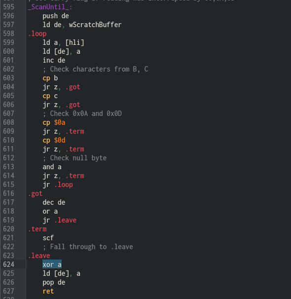
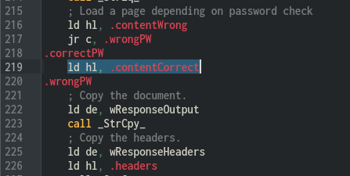
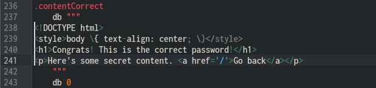
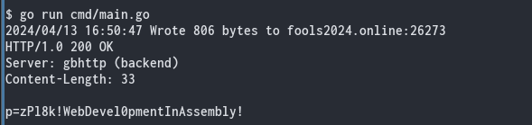

# Hacking Challenge III - gbhttp

[Go back to main page](/README.md)

> The GBZ80 architecture is truly amazing - so amazing that we've created a Game Boy HTTP server! It's running at http://fools2024.online:26273/. However, we haven't done a proper security audit of our code yet. Think you can steal the secret password from our test server? The [source code](https://fools2024.online/assets/gbhttp.asm) is available for you to review. 

In this challenge, we were provided with a web address to a production HTTP server and its source code - how convenient! - and we were told to obtain the flag from the production server. It would seem like a vanilla CTF affair, but here's the kicker - the server is written in SM83 assembly and runs in a Game Boy!

## Initial analysis

So I took a look at the source code. One thing that stood out to me immediately was the memory map. Let's take a look at it. The Game Boy has 8 KiB of work RAM, plus 128 bytes of on-die High RAM (a.k.a. HRAM, which is essentially scratch RAM that can be accessed faster with its own instructions). Here's how this is laid out for this program:

Work RAM:
- `0xC000`-`0xC7FF` - received request data buffer (2048 bytes)
- `0xC800`-`0xCFFF` - outgoing response data buffer (2048 bytes)
- `0xD000`-`0xD1FF` - temporary response headers buffer (512 bytes)
- `0xD200`-`0xD9FF` - temporary response body buffer (2048 bytes)
- `0xDA00`-`0xDBFF` - scratch buffer (512 bytes)
- `0xDC00`-`0xDCFF` - stack (256 bytes) - uninitialized on power-up
- `0xDD00`-`0xDFFF` - unused (768 bytes) - uninitialized on power-up

High RAM:
- `0xFF80` - driver status byte (for communication with the harness script that drives the Game Boy)
- `0xFF81`-`0xFF84` - numeric string buffer for computing content length
- `0xFF85`-`0xFF86` - pointer to the start of the URL query parameters in the request buffer
- `0xFF87`-`0xFF8F` - unused (9 bytes)
- `0xFF90`-`0xFFFF` - unused (112 bytes) - uninitialized on power-up

As we can see, apart from the driver status byte, the server's state is pretty much contained within the CPU registers and the stack, so we can't really make the server go haywire by corrupting work RAM. And trust me, I tried it anyway.

But if we can corrupt the stack during execution of a function, we can try to either construct a ROP chain, or inject an ACE payload. And the stack buffer happens to be suspiciously next to this scratch buffer...

## What kind of requests can we make in the first place?

It turns out that the first line of defense against malformed requests in this server is a check against line lengths. All lines must be shorter than 256 characters, or else the server will drop the request immediately and respond with status 413 - Request Entity Too Large.

"Well" - I thought - what if I make a request composed entirely of newline characters, could I overflow the request buffer? Assuming that the harness in production didn't truncate or reject requests that were larger than the 2048-byte request buffer, then yes, I could basically overwrite the entirety of work RAM with all `0x0A` followed by a `0x00` terminator, but the program would not crash and would still respond perfectly fine. After all, the stack was empty while the server was waiting for a request, and there was no critical data being overwritten by my request that was being read afterwards.

### What else?

So I began to dig into all of the functions. It seemed that apart from this line length check, this entire program seemed to only ever process the first line of a request. In other words, if it ever encountered a line break, a negative return would be issued (carry flag set), and the caller would initiate an error response such as a 403 status.

This seemed like a dead end, then. If the first line could supposedly only be 255 bytes long, this limited my maximum effective payload size and seemed to eliminate the possibility of a buffer overflow.

## Hiatus

At this point I was banging my head around. Trying to trace execution, reading function code over and over to see if I could find vulnerabilities, but no dice. I was never gonna find a vulnerability if I kept going this way. I had hit a brickwall.

So I decided to shelve this and go to challenge 4, and then back to challenge 2.

## Aww $@!", here we go again.

This was the last challenge I had to do, and after my success in challenge 2, my blood was still boiling a bit. On a sidenote - I was a bit surprised so many people had found this challenge easy, because to me, this code seemed pretty bulletproof at the time.

Now, the events that happened between me going back to challenge 3 and finding the exploit feel like a blur to me. I really don't remember anything. So let's get straight to the point.

### Sweet turnaround

I was playing around with the program in the debugger, invoking the `/secret` route, while conjecturing "well, the line length checking routine stops checking at a null terminator; what if I could somehow put a null terminator right before the URL parameters such that the line length checking stops there, but the rest of the URL parsing skips over it due to some sort of off-by-one bug? Maybe there's an off-by-one bug?"

I traced the `ScanUntil` function calls. No, there wasn't an off-by-one bug anywhere. I still continued tracing it just because there was nothing else I could do at that point, expecting the program to jump to `E400_BadRequest`.

But here's the kicker - execution suddenly fell through the `jp c, E400_BadRequest` instruction. I could not believe my eyes! The carry flag had been cleared somehow! I restarted the program and traced through it again, because I wanted to understand why it happened. And alas, there was the exploit:

<p align=center>
  
</p>

You see the `xor a` instruction being used to clear the a register there? It also clears the carry flag, after it's been set by the `scf` instruction above. So this function will NEVER return with the carry flag set! This means that we can manipulate null (`0x00`) as being the stop token for any part of the request!

This is easy to miss if you're not very experienced with SM83 assembly or if you're not paying close attention. It's an easy mistake to make as a programmer and a hard mistake to spot as a code reviewer. Very clever!

## Battle plan

In the `/secret` route, the URL parameter string gets decoded into the scratch buffer by the URLDecode function. This function stops when it finds any `0x00`, `0x0a` or `0x0d` byte. Fortunately for us, we now have a way to override the line length checking routine - we can simply replace the `?` symbol in the URL with a `0x00` byte, which `ScanUntil` will treat as a valid terminator due to its bug where it always returns a positive result.

The scratch buffer is only 512 bytes long, and right after it lies the stack buffer, which upon quick analysis by tracing contains only one address - the return address inside `AppRoute_Secret`.

Looking at `AppRoute_Secret`, my first plan was to write a parameter string that contains 766 bytes of garbage and two escape codes overriding the return address to point to this location:

<p align=center>
  
</p>

To explain what my plan was - I wanted to override the password check and drop myself straight into the secret area, where I thought the flag was (assuming the contents below would be changed in production):

<p align=center>
  
</p>

I tested the exploit locally, and it worked. Time to run it in production!

### Request sender script

I made a little program for sending raw requests. Originally I wanted to try to send the request with curl, but I couldn't get it to send a raw TCP request, so I quickly gave in and wrote a short Go program.

It's pretty simple - it just opens up a TCP socket to the server, writes the data, then reads out the response and prints it out on the terminal.

### It didn't work.

I mean, yeah, the exploit worked and my script worked. But I didn't get the flag. I got out exactly what was in the source code. That was disappointing.

I had misunderstood what the flag actually consisted of - the flag wasn't inside the password-protected area. The flag was the password itself! So I had to change my plan and actually pull off an ACE exploit to dump that password.

## Plan B - the ACE exploit

I used pretty much the same idea as before, but instead of returning straight to `AppRoute_Secret.correctPW`, I returned to my own payload which I injected right after the stack buffer. I decided to inject the payload after the stack buffer and not before, because it was easier to maintain address alignment since I was using URL escape codes to input it.

Here's the assembly code for my payload - it's pretty straightforward:

```
	ld hl, AppRoute_Secret.validPassword    ; %21%ea%03
	jp AppRoute_Secret.wrongPW              ; %c3%c6%03
```

`AppRoute_Secret` uses hl as a pointer to determine where in memory is the body contents to be returned in the response. Normally, it'll either point to `AppRoute_Secret.contentWrong` or `AppRoute_Secret.contentCorrect`, depending on whether you gave the password parameter correctly or not.

What I'm doing in my payload is overriding hl to point to `AppRoute_Secret.validPassword`, which contains the actual expected password parameter, and then jumping to the point in `AppRoute_Secret` where the body at hl is copied to the temporary response body buffer. In other words, this short code snippet abuses `AppRoute_Secret`'s own code to dump its password. :3

I quickly assembled it by hand, tested it in the emulator, verified it produced the correct output, and then proceeded to stick it into my script and run it:

<p align=center>
  
</p>

Success!

## Epilogue

This was definitely a very interesting challenge. A HTTP server running in a Game Boy? That has to be a first. I'd say we need to take this idea and improve it. What about dynamic content? What about injecting the request via link cable, so it could theoretically be run in a real Game Boy? There's so many possibilities!

I'm also happy I learned about behaviors of SM83 opcodes and how some of them can have unexpected side effects such as clearing the carry flag... coming from a 6502 programming background I'd never expect the `xor` opcode to clear the flags!

Let's remember, all of this was only possible due to our lord glitch scientist TheZZAZZGlitch! Many kudos to him.

[Go back to main page](/README.md)
