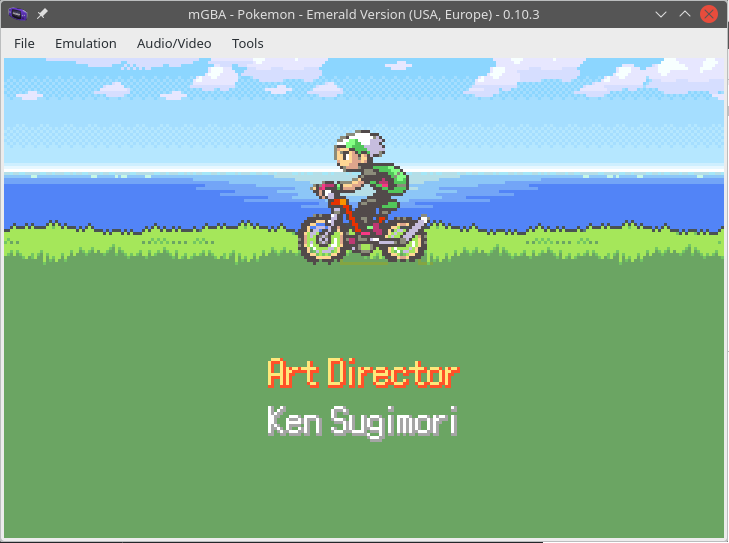

# Hacking Challenge IV - Pokémon Write-What-Where Version (Emerald)

[Go back to main page](/README.md)

> I love playing Pokémon Emerald! The buttons on my GBA are really worn off, and they don't work anymore... but who needs buttons when I have a debugger and a steady hand? As long as you tell me which memory addresses I need to modify on which frames, I should be good to go!
> 
> To complete this challenge, you will need to provide a solution file, which will contain a list of memory edits necessary to complete a fresh game of Pokémon Emerald from scratch. Completion is defined as viewing the credits. For more information about the file format, challenge premises and solution verification, visit the [Challenge IV: Information](https://fools2024.online/ch4.php) page.

In this challenge, we had to create a Any% Tool-Assisted Speedrun (TAS) of Pokémon Emerald. But not a standard TAS. Instead of button presses, we were only allowed to use lists of memory writes to RAM at each frame in order to finish the game, and we had a deadline of 9000 frames to do so.

## What exactly was at stake here?

Well, the description seemed kinda intimidating. It would seem like we would need to manipulate tons of memory addresses in order to simulate movement around the map, performing actions etc... nah. The information page made it clear: _viewing the credits counted as completion_. So what we really needed to do was a **credits warp**.

## What was the easiest way to do a credits warp?

My first thought? Let's corrupt the stack and make it return to the actual function in the game that invokes the credits screen! So I downloaded the pokeemerald repository and went to search for that.

I first went looking within `src/credits.c`, since that seemed like a good lead. Among many functions I landed in a function called `CB2_StartCreditsSequence`, which seemed promising. But there was something about its name - "CB2"... it was clearly a callback function. It wasn't meant to be called directly. That clearly wouldn't work, would it?

I tried it anyway. I grabbed the address for `CB2_StartCreditsSequence` straight from the symbols file, set up a stack corruption solution with it and ran it with the checker... and the game crashed as soon as it got to the relevant frame. So I guessed I should have called that function from the correct context after all. _(you wanna laugh, don't you?)_

### What calls CB2_StartCreditsSequence?

It doesn't take much looking around to get a hint. Within `CB2_StartCreditsSequence` itself, there's a hint about it:

```c
    BeginNormalPaletteFade(PALETTES_ALL, 0, 16, 0, RGB_BLACK);
    EnableInterrupts(INTR_FLAG_VBLANK);
    SetVBlankCallback(VBlankCB_Credits);
    m4aSongNumStart(MUS_CREDITS);
    SetMainCallback2(CB2_Credits);
    sUsedSpeedUp = FALSE;
    sCreditsData = AllocZeroed(sizeof(struct CreditsData));
```

Hmm... `SetMainCallback2(CB2_Credits)`... so there's such a thing as a MainCallback2... so can we find somewhere in the code that's setting MainCallback2 to `CB2_StartCreditsSequence`?

```
$ grep -r "SetMainCallback2(CB2_StartCreditsSequence)"
src/hall_of_fame.c:    SetMainCallback2(CB2_StartCreditsSequence);
```

Bingo. Let's take a look at the relevant function:

```c
static void StartCredits(void)
{
    SetMainCallback2(CB2_StartCreditsSequence);
}
```

As simple as that. I set up a stack corruption solution targeting a return to that function, ran it and... drumroll...

...it crashed. Just like the last time. _(don't fall off the chair yet!)_

## Plan B?

At this point I assumed I was perhaps not setting up my stack corruption properly and was corrupting registers instead of the program counter, making the code go haywire for some reason.

So I decided to go for a different approach - instead of corrupting the stack, since I now knew the credits scene is initialized through a callback, why not directly set the callback pointer in the struct? So I went to take a look inside the `SetMainCallback2` function. It's in `src/main.c`:

```c
void SetMainCallback2(MainCallback callback)
{
    gMain.callback2 = callback;
    gMain.state = 0;
}
```

Interesting, so it sets not only a pointer, but a state field. I didn't know why the state field was needed, but I decided to set it in order to replicate the behavior of the function. I went to take a look at the `gMain` struct, grabbed the offsets for the `callback2` and `state` fields, grabbed the address of the `gMain` struct from the symbols file, and wrote my solution. Ran it, and drumroll...

...it crashed. _(okay okay, we're getting there!)_

## So what?

At this point, I sat down with the debugger, and started to just stare at stuff for a couple of hours or so.

By the way, let me tell you something - I don't know if it's like this for everybody, but mGBA is such a crashfest for me. Every time I try to list or disassemble a large number of locations in the debugger, it just crashes. It's so annoying.

So yeah, it took me a couple of hours, but at some point I smelled something fishy in the `gMain` struct - some of the pointers in memory were misaligned by 1 byte! This seemed really odd. I hadn't touched those pointers at all, and the ROM was pristine, so how come were these pointers misaligned?

It was then that I had the brilliant idea to offset my pointer by +1 byte in the previous solution too, to see if it worked.

And would you believe it?

<p align=center>
  
</p>

I then uploaded my solution to the website, and it was accepted!

## So what was it?

The Game Boy Advance uses a microprocessor based around the ARMv4T (or ARM7TDMI) architecture. The ARM architecture can operate in two instruction modes:

- ARM, where instructions are 32-bit wide (4 bytes)
- Thumb, where instructions are 16-bit wide (2 bytes)

Thumb instructions are useful in order to save space, but are slower to execute. However, in the Game Boy Advance there are wait states for accessing the cartridge anyway, so the space savings are worth it, and as such a large portion of Pokémon Emerald is compiled into Thumb mode.

Well, I will admit I don't know this very explicitly, but from my tacit understanding of it it seems like the ARM architecture has a feature where it will automatically switch the CPU's instruction mode upon a jump depending on the least significant bits of the address. If the least significant bit is 0, it will switch to ARM mode; if it is 1, it will switch to Thumb mode. This way, you can encode pointers to regions of code containing different instruction modes than your current one without having to worry about performing a mode switch before jumping.

Well, I didn't know about this feature before! Would this actually mean that my stack corruption-based solutions would have worked if I had performed the Thumb mode signalling on the pointers? Well, I'm not sure if all of them would have worked, but at least some of them could have! Anyway, I feel like my current solution is a more robust and error-prone one.

## Epilogue

Saying this challenge was easy might be a bit unfair, to be honest. But I do feel like it wasn't too difficult. And it even taught me something about the ARM architecture that I didn't know about before!

Also, this is my first time doing any sort of TAS-like endeavour, if that even counts as such!

Overall, it was a quite enjoyable and fun challenge to do.

[Go back to main page](/README.md)
